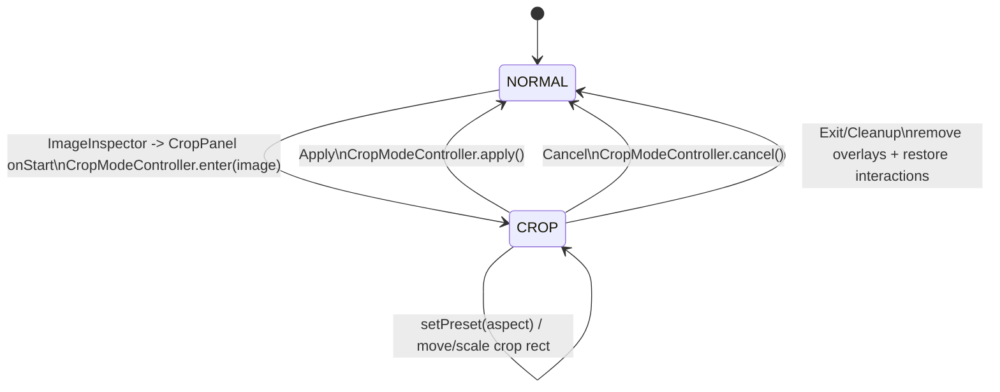

# Editor Internals

## 1) How to read this doc

This document describes **how Editor-MK currently works in code** (not a target architecture). Start with these files in order:

1. App bootstrap: `src/main.tsx` → `src/App.tsx`
2. Shell/layout orchestration: `src/editor/EditorShell.tsx`
3. Fabric canvas lifecycle + page hydration/persistence: `src/editor/CanvasStage.tsx`
4. Global state model: `src/editor/state/documentModel.ts`, `src/editor/state/useEditorStore.ts`

If you are onboarding, read sections **Core editor concepts** and **Tool-by-tool deep dive** first.

---

## 2) High-level architecture diagrams

### 2.1 Component + state + rendering flow

```mermaid
flowchart LR
  U[UI Panels/Inspectors\nTopBar/LeftSidebar/RightInspector/Footer] --> S[Zustand Store\nuseEditorStore]
  U --> C[(window.__editorCanvas)]
  S --> CS[CanvasStage]
  CS --> F[Fabric Canvas\ncreateCanvas]
  F --> H[HistoryManager\nsnapshot undo/redo]
  F --> SER[serialize.ts\nsave/load JSON]
  SER --> P[DocModel.pages[*].fabricJson + thumbnail]
  P --> S
  U --> EXP[exportPage/exportImage]
  EXP --> FS[file-saver download]
```

### 2.2 Crop mode state machine



---

## 3) Folder/module layout

```text
src/
  main.tsx, App.tsx
  editor/
    EditorShell.tsx, CanvasStage.tsx, hotkeys.ts
    state/
      documentModel.ts, useEditorStore.ts
    engine/
      createCanvas.ts, selection.ts, serialize.ts
      factories/ (addText/addImage/addShape/addTable)
      history/history.ts
      export/ (exportPage/exportImage)
    features/
      crop/ (CropModeController + math + overlay)
      pages/pagesController.ts
      templates/manifest.ts
      layers/layersController.ts
      shapes/shapeGeometry.ts
    ui/
      TopBar.tsx, Toolbar.tsx, LeftSidebar.tsx, RightInspector.tsx, Footer.tsx
      CropPanel.tsx
      panels/ (Templates/Uploads/Text/Shapes/Tables/Pages/Layers/Settings)
      inspector/ (ObjectContextMenu + Text/Image/Table/Shape inspectors)
```

### Category responsibilities and boundaries

- **App shell & orchestration**: `EditorShell` wires hotkeys, stage readiness, and page navigation actions; `CanvasStage` owns Fabric instance lifecycle. UI components call store updates and/or `window.__editorCanvas` operations.
- **State/store**: `DocModel` holds document metadata, canvas frame, pages, export settings; Zustand store tracks document and UI selection/tab state.
- **Canvas adapter**: `createCanvas` configures Fabric and object normalization hooks; `selection.ts` translates Fabric selection events to store-friendly `{id,type}`.
- **Tools and content creation**: factory modules add typed Fabric objects (`data.type` used throughout inspectors/layers/selection).
- **Templates/pages**: template manifest loading + page list mutation controllers.
- **History/undo-redo**: snapshot-based with debounce + coalescing.
- **Export**: current canvas export and selected-image export.

---

## 4) Core editor concepts

### 4.1 Fabric canvas lifecycle

- `CanvasStage` creates Fabric canvas via `createCanvas(...)`, instantiates `HistoryManager`, binds history + selection listeners, and registers autosave listeners on object/text events.
- It exposes canvas globally via `window.__editorCanvas` for UI modules.
- On unmount, it unbinds listeners, clears timers, and disposes canvas.
- Canvas frame updates (`width/height/background`) are applied through `applyCanvasFrame` with viewport reset.

Key files:
- `src/editor/CanvasStage.tsx`
- `src/editor/engine/createCanvas.ts`

### 4.2 Document model and pages

- `DocModel` includes: `canvas` frame, `pages[]` with per-page `fabricJson` (+ optional `thumbnail`), `activePageId`, export config, fonts metadata.
- Blank docs/pages are created in `documentModel.ts`.
- `CanvasStage` persists current page snapshot on object lifecycle events and page switches.
- On page switch, previous page is snapshotted and next page `fabricJson` is loaded into canvas via `history.loadSnapshot`.

Key files:
- `src/editor/state/documentModel.ts`
- `src/editor/CanvasStage.tsx`
- `src/editor/features/pages/pagesController.ts`

### 4.3 Selection model

- Fabric selection events are mapped by `bindSelectionEvents(...)`.
- Selected object identity/type are read from `obj.data.id` and `obj.data.type`.
- Crop overlays are intentionally excluded from selection sync to prevent inspector churn.

Key files:
- `src/editor/engine/selection.ts`
- `src/editor/engine/factories/*.ts` (object `data` metadata)

### 4.4 Serialization/persistence model

- Save: `saveCanvasJson` calls Fabric `toJSON` including custom properties (`data`, crop fields, table metadata).
- Load: `loadCanvasJson` sanitizes text-like objects (`text` fallback), clears canvas, loads JSON, waits for font readiness, reapplies runtime handle/shape metadata.
- Persistence strategy: per-page `fabricJson` + lightweight page thumbnail generated from current canvas.

Key files:
- `src/editor/engine/serialize.ts`
- `src/editor/CanvasStage.tsx`

### 4.5 Undo/redo strategy

- Snapshot-based history (`HistoryManager`) with:
  - max entries cap,
  - debounced capture,
  - separate text-edit debounce,
  - coalescing for repeated modifications of same object in a short window.
- `undo()` swaps from undo stack to redo stack and loads prior snapshot; `redo()` applies from redo stack.
- Initial baseline snapshot is captured at canvas setup.

Key files:
- `src/editor/engine/history/history.ts`
- `src/editor/EditorShell.tsx` (hotkeys and top-bar buttons call undo/redo)
- `src/editor/hotkeys.ts`

### 4.6 Templates

- Template list is fetched from `public/templates/manifest.json` through `loadTemplateManifest()`.
- Applying a template updates doc canvas size and replaces document pages with first page carrying fetched JSON, then hydrates canvas with `loadCanvasJson`.

Key files:
- `src/editor/features/templates/manifest.ts`
- `src/editor/ui/panels/TemplatesPanel.tsx`
- `public/templates/manifest.json`

### 4.7 Exports (current)

- **Current page**: direct `canvas.toDataURL(...)` then `file-saver` download.
- **Selected image**: exports only active image crop window at display size (`cropX/cropY/width/height` + multiplier).

Key files:
- `src/editor/engine/export/exportPage.ts`
- `src/editor/engine/export/exportImage.ts`
- `src/editor/ui/TopBar.tsx`, `src/editor/ui/inspector/ImageInspector.tsx`

---

## 5) Tool-by-tool deep dive

## 5.1 Selection / move / resize

- **User-facing UX**: default mode via Select tab/button; selecting object opens right inspector and quick actions.
- **State**: `selectedObjectId`/`selectedObjectType` in store.
- **Fabric ops**: active object mutation, alignment movement, size transforms, opacity/fill/stroke updates.
- **Events**: `selection:*`, `object:moving`, `object:scaling`, `object:modified` used to sync inspector/layers.
- **Persistence**: autosave in `CanvasStage` snapshots changed canvas into active page.
- **Edge cases**:
  - Crop frame dimensions handled specially in `ObjectContextMenu`.
  - Textbox width updates preserve mirrored scale sign.

Files:
- `src/editor/engine/selection.ts`
- `src/editor/ui/inspector/ObjectContextMenu.tsx`
- `src/editor/ui/Toolbar.tsx` (quick duplicate/bring-forward/delete)
- `src/editor/CanvasStage.tsx`

## 5.2 Text tool

- **UX**: Left sidebar → Text panel → “Add text”; formatting in Text inspector and Toolbar.
- **State**: object carries `data.type = "text"`; store selection type drives inspector rendering.
- **Fabric ops**: creates `Textbox`; mutations adjust font weight/style/underline/align/lineHeight/charSpacing/fontSize.
- **Events**: history tracks `text:changed` and `text:editing:exited` with text-specific debounce.
- **Persistence**: captured by autosave + history snapshots.
- **Edge cases**: serializer enforces empty string fallback for malformed text objects.

Files:
- `src/editor/engine/factories/addText.ts`
- `src/editor/ui/panels/TextPanel.tsx`
- `src/editor/ui/inspector/TextInspector.tsx`
- `src/editor/engine/history/history.ts`
- `src/editor/engine/serialize.ts`

## 5.3 Image tool

- **UX**: Upload image from Uploads panel; image inspector offers crop mode and export selected image.
- **State**: `data.type = "image"`; crop state persisted on object as `cropState` / `__cropState` (+ custom JSON properties).
- **Fabric ops**: `FabricImage.fromURL(..., crossOrigin:"anonymous")`, positioning, crop parameter writes (`cropX/cropY/width/height`).
- **Events**: selection sync in inspector; crop controller binds moving/scaling events for crop rect and image.
- **Persistence**: crop metadata included by `saveCanvasJson` and restored by `loadCanvasJson`.
- **Edge cases**: existing crop is expanded to natural image before re-entering crop edit; min crop size enforced.

Files:
- `src/editor/engine/factories/addImage.ts`
- `src/editor/ui/panels/UploadsPanel.tsx`
- `src/editor/ui/inspector/ImageInspector.tsx`
- `src/editor/features/crop/CropModeController.ts`
- `src/editor/engine/serialize.ts`

## 5.4 Table tool

- **UX**: Tables panel adds default 3x3 table; table inspector currently read-only metadata display.
- **State**: grouped object has `data.type = "table"` and custom `table` payload.
- **Fabric ops**: creates `Group` with background rect, lines, and per-cell `IText` children.
- **Events**: general object events/history/autosave apply like other objects.
- **Persistence**: `table` custom property is whitelisted in serialization.
- **Edge cases**: cell-level editing is inside grouped `IText` children but no dedicated table editing controller yet.

Files:
- `src/editor/engine/factories/addTable.ts`
- `src/editor/ui/panels/TablesPanel.tsx`
- `src/editor/ui/inspector/TableInspector.tsx`
- `src/editor/engine/serialize.ts`

## 5.5 Pages (add / duplicate / delete / switch / reorder)

- **UX**: Pages panel supports add/duplicate/delete/up/down/reselect; top bar supports page number input and previous/next controls.
- **State**: page array + `activePageId` mutated through pure controller helpers.
- **Fabric ops**: switching page triggers save of previous snapshot then load of next page JSON.
- **Events**: page hotkeys (PageUp/PageDown, Alt+ArrowUp/Down).
- **Persistence**: each page stores independent `fabricJson` and optional thumbnail.
- **Edge cases**: deleting last remaining page is blocked.

Files:
- `src/editor/features/pages/pagesController.ts`
- `src/editor/ui/panels/PagesPanel.tsx`
- `src/editor/ui/TopBar.tsx`
- `src/editor/EditorShell.tsx`
- `src/editor/CanvasStage.tsx`
- `src/editor/hotkeys.ts`

## 5.6 Templates (load/apply)

- **UX**: Template list in Templates panel; click applies template.
- **State**: template apply resizes canvas and resets pages list to a single active page loaded from template JSON.
- **Fabric ops**: `loadCanvasJson` hydrates current canvas instance.
- **Events**: none special beyond standard render/history interactions.
- **Persistence**: resulting page JSON becomes page `fabricJson`; subsequent autosave handles edits.
- **Edge cases**: manifest fetch failures collapse panel to empty list.

Files:
- `src/editor/features/templates/manifest.ts`
- `src/editor/ui/panels/TemplatesPanel.tsx`
- `public/templates/manifest.json`

## 5.7 Crop mode (presets, custom dimensions, apply/cancel)

- **UX**:
  - Enter via Image inspector Crop button.
  - Preset aspect buttons (Free, 1:1, 4:3, 16:9, 4:5, 3:2).
  - Apply/Cancel controls.
  - Custom width/height is available through generic `ObjectContextMenu` dimensions while crop frame is active.
- **State**:
  - controller-local: `image`, `cropRect`, mask/grid overlays, snapshot, current aspect.
  - persisted: `cropState` and `__cropState` on image.
- **Fabric ops**:
  - creates overlay rect + grid + mask segments,
  - clamps crop rect to image bounds,
  - transforms crop rect to source params,
  - writes crop params back onto image and repositions.
- **Events**: binds `object:moving` and `object:scaling` handlers for crop rect and image, then unbinds on exit.
- **Persistence**: crop props serialized via save whitelist and Fabric custom properties.
- **Edge cases**:
  - crop minimum size enforced.
  - prior crop state re-open path resets to natural image first.
  - interaction lock/unlock for non-active objects while cropping.

Files:
- `src/editor/features/crop/CropModeController.ts`
- `src/editor/features/crop/cropOverlay.ts`
- `src/editor/features/crop/cropMath.ts`
- `src/editor/ui/CropPanel.tsx`
- `src/editor/ui/inspector/ObjectContextMenu.tsx`

## 5.8 Export current page

- **UX**: top bar export button + PNG/JPG toggle.
- **State**: format/multiplier read from `doc.export`.
- **Fabric ops**: current page uses in-memory canvas directly.
- **Events**: none.
- **Persistence**: export reads persisted page JSON; no doc mutation.
- **Edge cases**: export captures current canvas at chosen multiplier and format.

Files:
- `src/editor/ui/TopBar.tsx`
- `src/editor/engine/export/exportPage.ts`

## 5.9 Undo/redo + keyboard shortcuts

- **UX**: top bar buttons and keyboard (`Ctrl/Cmd+Z`, `Shift+Ctrl/Cmd+Z`, `Ctrl/Cmd+Y`).
- **State**: in-memory history stacks inside `HistoryManager`.
- **Fabric ops**: snapshot save/load JSON round-trips canvas.
- **Events**: tracks add/remove/modify/text events with debounce/coalescing.
- **Persistence**: history stacks are runtime-only; persisted document stores only latest page snapshots.
- **Edge cases**: undo is no-op until at least two snapshots exist.

Files:
- `src/editor/engine/history/history.ts`
- `src/editor/hotkeys.ts`
- `src/editor/EditorShell.tsx`
- `src/editor/ui/TopBar.tsx`

---

## 6) Extension points: adding a new tool safely

1. **Add a UI entry point**
   - Add a tab/button in `src/editor/ui/LeftSidebar.tsx` or relevant inspector/panel.
2. **Add tool controller/factory logic**
   - Stateless object creation: add in `src/editor/engine/factories/`.
   - Stateful modal behavior: add under `src/editor/features/<tool>/...` (CropModeController is the pattern).
3. **Tag objects with metadata**
   - Always set `obj.data = { id, type, name, ... }` so selection/layers/inspectors can identify the object.
4. **Bind/unbind events explicitly**
   - Follow crop controller pattern: track listeners and remove all on exit/unmount.
5. **Integrate snapshots/history**
   - Prefer mutating Fabric objects through normal object events (`object:added/modified/...`) so autosave/history trigger automatically.
   - If you perform non-standard mutations, ensure `canvas.requestRenderAll()` and consider explicit `history.capture(...)` where needed.
6. **Ensure serialization compatibility**
   - Add custom properties to `saveCanvasJson` whitelist and any Fabric customProperties registration if needed.
7. **Inspector integration**
   - Route by `selectedObjectType` in `RightInspector` and add per-tool inspector component.

---

## 7) Known limitations / tech debt (code-evidenced)

- **Canvas access pattern**: many UI modules call `(window as any).__editorCanvas` directly instead of consuming a typed context/stage API.
- **Template apply currently replaces document pages with one page** rather than importing full multi-page template packs.
- **Crop shape support**: `circleMask.ts` exists, but crop mode currently implements rectangular crop overlays and does not wire circle masking into the active crop pipeline.
- **Table editing depth**: tables are grouped primitives with minimal inspector controls (rows/cols readout only).

---

## 8) Fast module map appendix (manual inventory)

### Entry points
- `src/main.tsx`
- `src/App.tsx`
- `src/editor/EditorShell.tsx`
- `src/editor/CanvasStage.tsx`

### Tool-related modules by keyword
- Crop: `src/editor/features/crop/*`, `src/editor/ui/CropPanel.tsx`, `src/editor/ui/inspector/ImageInspector.tsx`
- Undo/redo/history: `src/editor/engine/history/history.ts`, `src/editor/hotkeys.ts`, `src/editor/EditorShell.tsx`
- Export: `src/editor/engine/export/*`, `src/editor/ui/TopBar.tsx`, `src/editor/ui/inspector/ImageInspector.tsx`
- Templates: `src/editor/features/templates/manifest.ts`, `src/editor/ui/panels/TemplatesPanel.tsx`, `public/templates/manifest.json`
- Pages: `src/editor/features/pages/pagesController.ts`, `src/editor/ui/panels/PagesPanel.tsx`, `src/editor/ui/TopBar.tsx`
- Fabric/canvas: `src/editor/engine/createCanvas.ts`, `src/editor/CanvasStage.tsx`, `src/editor/engine/serialize.ts`, `src/editor/engine/selection.ts`
